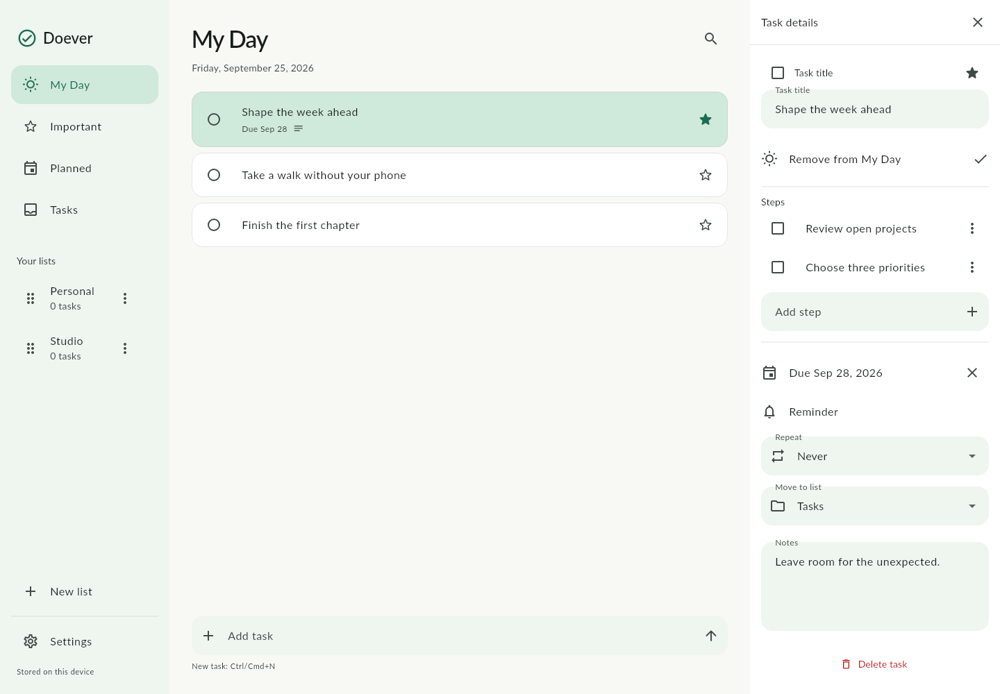

# Doever

**Do what matters.**

Doever is a modern, open-source, local-first task manager built with Flutter.
Tasks stay on your device; no account or network connection is needed on native platforms.

## Features

- Fast inline task creation, completion, importance, notes, and search.
- My Day, Important, Planned, and an Inbox named Tasks; smart views share the same task records.
- Custom lists, renaming, stable reordering, and moving tasks between lists.
- Steps with editing, completion, deletion, and reordering.
- Calendar due dates, local reminders, and daily/weekday/weekly/monthly/yearly recurrence.
- Task deletion with undo. Deleting a custom list moves surviving tasks into Tasks.
- Adaptive sidebar/list/detail panes on desktop, drawer navigation and dedicated details on phones.
- Light, dark, and system appearance; keyboard shortcuts and English localization foundations.

## Screenshots

Generated from deterministic widget tests using the bundled font:



[Desktop dark](test/goldens/dark_desktop.png) · [Phone light](test/goldens/light_phone.png) · [Phone dark](test/goldens/dark_phone.png)

## Platforms and requirements

Flutter **3.47.2 stable**, Dart **3.13.2**, and the corresponding native platform toolchain.
The lockfile records the resolved compatible package versions.

| Platform | Status |
| --- | --- |
| Android | Priority target; debug build and emulator smoke test are part of validation. |
| Windows | x64 release build verified on GitHub Actions; interactive Windows runtime validation remains pending. |
| Linux | Release build and desktop persistence smoke test validated on Ubuntu 26.04 x86_64; scheduled reminders are unavailable in the notification plugin. |
| macOS / iOS | Runners and notification configuration included; require validation on Apple hardware. |
| Web | Compiles with local SQLite WASM and worker assets; scheduled reminders unavailable. Browser storage can be cleared/evicted. |

See [validation notes](docs/VALIDATION.md) for what was actually run, rather than treating this table as release certification.

## Run locally

```sh
git clone <your-repository-url>
cd doever_app
flutter pub get
flutter run -d windows       # on Windows
flutter run -d <android-id>  # flutter devices lists connected devices
```

Generated Drift and localization sources are included. After changing the schema or ARB strings:

```sh
dart run build_runner build
flutter gen-l10n
```

Android uses Java 17-compatible compilation, desugaring, and SDK versions selected by Flutter.
The debug APK is produced with `flutter build apk --debug`. Configure your own signing before distributing an Android release; the generated runner uses debug signing for local release builds.

For web, committed SQLite assets permit a build without downloading database files:

```sh
flutter build web --no-web-resources-cdn
```

Serve `build/web` over localhost or HTTPS with `application/wasm` for `.wasm` files.
SQLite chooses browser-supported persistent storage. Native installations are the fully offline distribution target in v0.1; web needs its application assets to be served and does not yet install an offline service worker.
To regenerate the web worker: `dart compile js web/drift_worker.dart -o web/drift_worker.dart.js`.
See [third-party notices](THIRD_PARTY_NOTICES.md) for binary asset provenance.

## Desktop release packages

Run `bash tool/build_linux.sh` on Linux, or `./tool/build_windows.ps1` from
PowerShell on Windows. Each produces a release executable with its required
libraries/resources and a compressed package in `build/releases/`.
See [desktop build instructions](docs/DESKTOP_BUILDS.md) for prerequisites,
launch commands, compatibility, and the existing Windows CI build.

## Tests and checks

```sh
dart format --output=none --set-exit-if-changed lib test integration_test tool web/drift_worker.dart
flutter analyze
flutter test
flutter test integration_test/app_test.dart -d <android-or-desktop-id>
```

Tests cover smart queries, literal search, calendar dates, recurrence boundaries,
CRUD, reordering, deletion/undo, file-backed restart persistence, the committed
schema, reminder permissions/retries, widget interactions, text scaling, and visual snapshots.
The integration test uses an isolated on-disk database and fake notifications; it does not alter your task database.
OS delivery and permission dialogs require the manual checks in [validation notes](docs/VALIDATION.md).

Update visual baselines intentionally with `flutter test test/visual_test.dart --update-goldens` on the pinned Linux toolchain. Review every changed image.

## Architecture

Feature-first domain, application, data, and presentation boundaries:

```text
lib/app/                         bootstrap, routing, providers, design tokens
lib/core/                        failures, logging, reminder adapter/outbox worker
lib/database/                    Drift tables, schema version, connection strategy
lib/features/tasks/domain/       Dart-only entities, dates, RRULE subset, repository contract
lib/features/tasks/application/  reminder permission and assignment use case
lib/features/tasks/data/         transactional Drift repository
lib/features/tasks/presentation/ adaptive task list, details, steps, inline editors
lib/features/lists/              list entity and navigation
lib/features/settings/           preferences UI
lib/l10n/                        English ARB and generated localization
```

UI consumes repository streams through Riverpod. SQLite runs in a background isolate
on native platforms. Preferences alone use SharedPreferences. No widget queries SQL.
See [architecture decisions](docs/ARCHITECTURE.md) for date, recurrence, ordering,
notification consistency, and migration rules.

## Reminders and recurrence

Notification permission is requested only when assigning a reminder. Android uses
inexact alarms to avoid special exact-alarm permission; the OS may delay delivery.
Boot receivers restore scheduled alarms after reboot. Windows schedules one-shot
notifications; unpackaged applications can cancel pending reminders, but removing
already displayed notifications requires package identity (MSIX).

Completing a recurring task creates its next occurrence atomically, copying notes
and resetting steps. My Day and reminders are intentionally not copied. Set reminders
per occurrence. Uncompleting/recompleting the original never creates duplicates and
does not delete an already-created next occurrence. Invalid monthly/yearly dates
are skipped per RFC 5545, e.g. January 31 → March 31.

## Privacy

No authentication, analytics, advertising, telemetry, or cloud APIs. Task content
is never sent to a remote service. Fonts and database runtime assets are bundled.
Data is stored in the application's support directory (`doever.sqlite`) or the
browser's origin storage. Local OS notifications can display task titles; Android
marks them private on the lock screen. SQLite is not encrypted by Doever; device
security, OS backups, and access to the local user profile remain relevant.
Logs contain operation names, exception types, and stacks, never task text or SQL parameters.

## Contributing and roadmap

Read [CONTRIBUTING.md](CONTRIBUTING.md), [CODE_OF_CONDUCT.md](CODE_OF_CONDUCT.md), and [SECURITY.md](SECURITY.md).
The next phase can add sync through the repository boundary. Accounts, cloud sync,
collaboration, integrations, and AI are not implemented or shown as unfinished UI.
Near-term work is platform delivery validation, signed installers, localization,
and performance measurements on large personal datasets.

## License

[MIT](LICENSE), copyright Felipe Opazo Figueroa. Bundled assets retain their respective licenses.
